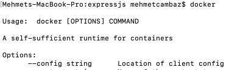
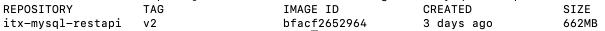

# Dockerize Node.js application

At this document we will dockerize [this](https://github.com/cambazm/NodeExpressJsRestApiToMysql) simple NodeJS REST API insert/select data to/from MySql application

## 1. Create a file called Dockerfile in the node.js application folder (mine was itx-mysql-restapi) and copy below content into it:
```
FROM node:6.9.2
WORKDIR /usr/src/itx-mysql-restapi
COPY package*.json ./
RUN npm install
COPY . .
EXPOSE 3000
CMD [ "node", "server.js" ]
```

## 2. Check if you can reach docker command via terminal, if it is not installed you can install Docker Desktop easily to add to your environment


## 3. Execute below command, it will set your minikube environment to see local docker images:
`eval $(minikube docker-env)`

## 4. Execute below command, it will build your docker image with the Dockerfile contents you had created
`docker build -t itx-mysql-restapi:v2 .`

## 5. Control your docker image you had built
`docker images itx-mysql-restapi`
<br />


## Note: We had done this sample as a local docker image repository however in real world it is common to push the docker image to a registry so that it can be pulled from a central place. For example you can pull the official MySql image from Docker Hub [here](https://hub.docker.com/_/mysql)

